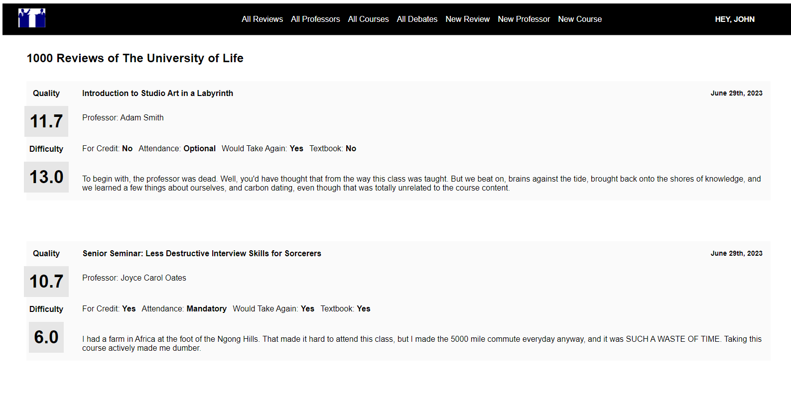
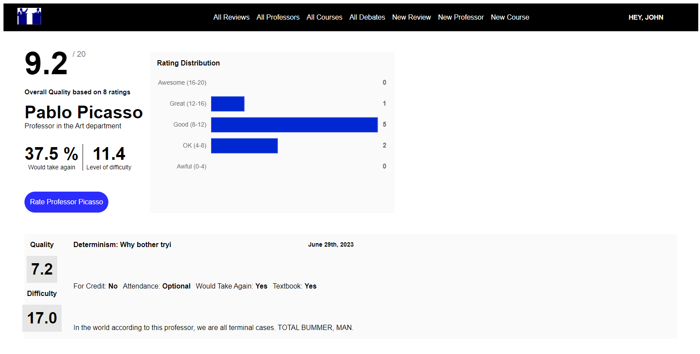
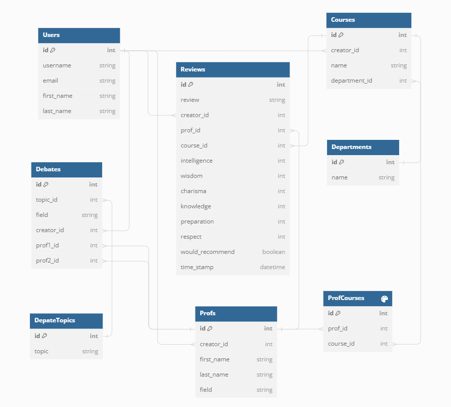

# Debate My Professors
Welcome to Debate My Professors, a clone of the website Rate My Professors populated by famous historical academics. The backend server was created with SQLite/SQLAlchemy and Flask; the frontend was created with React/Redux/JavaScript and styled with vanilla CSS.

Users of Debate My Professors can:

* View all reviews
* View details of a single review
* View all professors
* View details of a single professor, including the professor's aggregate review data
* View all courses
* View details of a single course, include the course's aggregate review data
* View all debates
* View details of a single debate
* Create new accounts
* Review a professor
   * Update their reviews
   * Delete their reviews
* View all their reviews
* Create new professors
   * Update details of professors they created
   * Delete professors they created
* Create new courses
   * Update details of courses they created
* Simulate the results of a debate
* Create a new debate


## Screenshots
### Landing Page
The landing page has links to view all reviews, professors, course, and debates. Logged-in users have links to create new reviews, professors, course, and debates.

### All Reviews Page
The page for all reviews shows the course details, including aggregate data for all reviews of a course, for each review, with a link to the individual review.

### Single Review Page
The page for a single review shows all the details for a single review.

### Single Professor Page
The page for a single professor shows the aggregate data of all a professor's reviews, including a bar chart summary, and has a list of all the reviews of a professor.

### All Debates Page
The page for all debates lists all debates with the topic and professors.

### DB Schema



The site is currently live at: https://debate-my-professors.onrender.com/. You can also clone the repo and run the app locally by following the instructions below.

## Getting started
1. Clone this repository (only this branch)

2. Install dependencies

      ```bash
      pipenv install -r requirements.txt
      ```

3. Create a **.env** file based on the example with proper settings for your
   development environment

4. Make sure the SQLite3 database connection URL is in the **.env** file

5. This starter organizes all tables inside the `flask_schema` schema, defined
   by the `SCHEMA` environment variable.  Replace the value for
   `SCHEMA` with a unique name, **making sure you use the snake_case
   convention**.

6. Get into your pipenv, migrate your database, seed your database, and run your Flask app

   ```bash
   pipenv shell
   ```

   ```bash
   flask db upgrade
   ```

   ```bash
   flask seed all
   ```

   ```bash
   flask run
   ```

7. To run the React App in development, checkout the [README](./react-app/README.md) inside the `react-app` directory.
